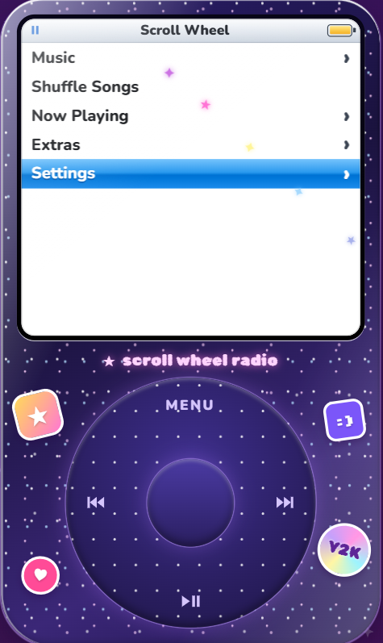
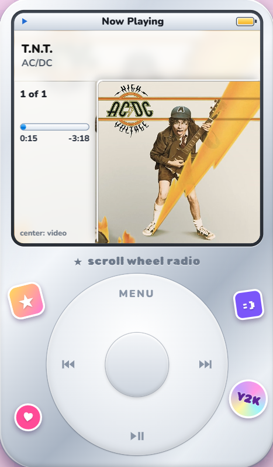

## ✨ Case designs

<p align="center">
  
  &nbsp;&nbsp;
  
</p>

<p align="center">
  <em>Midnight Glitter</em> &nbsp; · &nbsp; <em>Chrome Silver</em>
</p>


# ★ Scroll Wheel Radio

A Y2K, Gen Z–flavored music player for the browser that looks and works like a classic click-wheel MP3 player. Spin the wheel to scroll, click to pick, and play music from YouTube. Works with a mouse, a trackpad, a keyboard and touch screens.

- Vite + React for the app shell, with the player experience and behavior modules in JavaScript
- YouTube IFrame Player API for playback, YouTube Data API v3 for search
- Playlists, settings and recently played are saved in your browser (localStorage)
- Installable app shell with offline access to the interface (music streaming still needs internet)
- Opens directly into the click-wheel player; the welcome message appears on the iPod screen at startup
- Deploys as a static site (Vercel, Netlify, GitHub Pages)

---

## Controls

| Action | Click wheel | Keyboard |
| --- | --- | --- |
| Scroll | Drag around the wheel (1 tick every 22.5°) or use the mouse wheel | ↑ / ↓ |
| Select | Tap the center button | Enter |
| More options (on a song) | Hold the center button | Hold Enter |
| Back / menu | Tap **MENU** | Esc or Backspace |
| Play / pause | Tap **▶❚❚** | Space |
| Previous / next | Tap **⏮** / **⏭** | ← / → |

On **Now Playing**: spinning changes the volume, tapping the center switches between cover view and video view, and holding the center switches to scrubbing (spin to move through the song).

A drag that starts on MENU, ⏮, ⏭ or ▶❚❚ still scrolls; it only counts as a button press if you lift your finger without spinning.

## Menus

- **Music** — Playlists, Songs (A–Z), Artists, Cover Flow, Recently Played, Up Next, Search, Add from Link
- **Shuffle Songs**
- **Now Playing**
- **Extras** — Clock, Stopwatch, Brick Breaker (spin to move the paddle)
- **Settings** — Skins, Save as App, Click Sound, Backlight, Shuffle, Repeat, About, Reset

Skins: Chrome Silver, Bubblegum Pink, Frosted Lime, Midnight Glitter, Translucent Ice (see-through shell).

---

## Run it locally

You need [Node.js](https://nodejs.org) 18 or newer.

```bash
npm install
npm run dev
```

Open the address it prints (usually http://localhost:5173).

To make a production build: `npm run build` (output goes to `dist/`), then `npm run preview` to test it.
The iPod player opens directly at `/`.

## Save the player as an app

Deploy over HTTPS, open the player, then:

- **iPhone / iPad:** Open the player in Safari, tap **Share → Add to Home Screen → Add**, then launch it from the new home-screen icon. iOS does not provide the same install prompt as Chrome.
- **Android / desktop:** In a supported browser, use its install icon or menu and choose **Install app** / **Add to Home screen**. The in-player **Settings → Save as App** page also offers the browser install prompt when available.

The service worker caches the app interface and same-origin assets so the shell can open offline after its first visit. YouTube search and streaming require an internet connection; the service worker does not cache YouTube media. Installation requires HTTPS (localhost is supported for development).

### Add your YouTube API key (optional)

Without a key everything works except **Search** and **importing whole playlists**: you can still add songs with **Music › Add from Link**.

1. Copy `.env.example` to a new file called `.env.local`.
2. Paste your key after `VITE_YT_API_KEY=`.
3. Restart `npm run dev`.

`.env.local` is in `.gitignore`, so your key won't be committed to GitHub.

---

## How to get a YouTube Data API key

1. Go to the [Google Cloud Console](https://console.cloud.google.com/) and sign in.
2. At the top, click the project picker → **New Project**. Name it (e.g. "Scroll Wheel Radio") and click **Create**. Make sure the new project is selected.
3. Open **APIs & Services → Library**, search for **YouTube Data API v3**, open it and click **Enable**.
4. Open **APIs & Services → Credentials** → **Create credentials → API key**. Copy the key.

The free quota is 10,000 units per day. One search costs 100 units, so that's roughly **100 searches a day** for everyone using your site combined. The app caches search results for the browser session so repeating a search is free. Adding a single link costs 1 unit; importing a playlist costs about 1 unit per 50 songs.

## How to restrict the key to your website

Because this is a static site, the key is included in the JavaScript that visitors download, so anyone can see it. Restricting it means it only works on your site and only for YouTube.

1. In **APIs & Services → Credentials**, click your API key.
2. Under **Application restrictions**, choose **Websites**.
3. Under **Website restrictions**, add one line per address:
   - `https://your-site.vercel.app/*` (your real domain)
   - `https://*.your-domain.com/*` if you use a custom domain
   - `http://localhost:5173/*` so it keeps working while you develop
4. Under **API restrictions**, choose **Restrict key** and select only **YouTube Data API v3**.
5. Click **Save**. Changes can take a few minutes to apply.

If search shows "This API key is not allowed on this website", the address you're visiting isn't in the list from step 3.

---

## Deploy for free on Vercel

1. Push this folder to a GitHub repository.
2. Go to [vercel.com](https://vercel.com), sign in with GitHub, click **Add New… → Project** and import the repository.
3. Vercel detects Vite automatically (build command `npm run build`, output directory `dist`). Leave those as they are.
4. Open **Environment Variables** and add `VITE_YT_API_KEY` with your key.
5. Click **Deploy**. You'll get an address like `https://scroll-wheel-radio.vercel.app`.
6. Add that address to the key's website restrictions (see above).

If you add or change the environment variable later, redeploy (Deployments → ⋯ → Redeploy), because Vite puts the key into the build.

Using the command line instead: `npx vercel` (first deploy), then `npx vercel --prod`.

### Other free hosts

- **Netlify**: "Add new site → Import from Git", build command `npm run build`, publish directory `dist`, and add `VITE_YT_API_KEY` under Site configuration → Environment variables.
- **GitHub Pages**: run `npm run build` and publish the `dist` folder (for example with the `actions/deploy-pages` workflow). The build uses relative paths (`base: './'` in `vite.config.js`), so it works from `https://username.github.io/repo-name/`. Remember the key ends up in the published files, so restrict it.

---

## Project structure

```
index.html          React/Vite app document
src/main.jsx        React entry point
src/App.jsx         React app shell for the iPod player
public/app-icon.svg install and home-screen icon
public/favicon.svg  browser tab icon
public/manifest.webmanifest PWA identity, display mode and start URL
public/sw.js        offline cache for the app shell and same-origin assets
src/main.js         existing player start-up: scaling, wheel + keyboard wiring, splash, backlight, battery, offline
src/install.js      native browser install prompt management
src/wheel.js        click wheel: Pointer Events angle math, buttons, hold, mouse wheel
src/menus.js        screen navigation + transitions, lists, wheel keyboard, Cover Flow, every menu
src/nowplaying.js   Now Playing screen (cover / video view, volume, scrubbing)
src/player.js       YouTube IFrame player: queue, shuffle, repeat, skipping, Media Session, tab title
src/youtube.js      Data API search, link parsing, title cleanup, thumbnails
src/storage.js      localStorage: songs, playlists, settings, recently played
src/extras.js       Clock, Stopwatch, Brick Breaker
src/sound.js        click sound (Web Audio API) + vibration
src/fx.js           sparkles and the star cursor trail
src/ui.js           DOM helpers, toasts, square cover art, icons
src/skins.js        list of skins
src/skins.css       the five skins
src/style.css       layout and every screen's styles
```

## Good to know

- **YouTube's rules.** The YouTube player can't be hidden while it plays and must be at least 200×200 px. On Now Playing the video always stays visible at 200×200 or larger (the app enlarges it if the device is scaled down on small screens). When you browse other menus the video is behind the menu while music keeps playing; if you want to stay strictly within YouTube's terms, return to Now Playing while listening, or change `onLeave` in `src/nowplaying.js` to pause playback.
- **Phones need a tap before sound.** The "tap the wheel to start" screen unlocks audio. If a phone still refuses to start a video, the app switches to video view and asks you to tap the video once.
- **Background playback.** Many phones pause YouTube embeds when the browser goes to the background or the screen locks. Lock-screen and media-key controls work while the page is active, where the browser supports the Media Session API.
- **Videos that can't be embedded** are skipped automatically with a message.
- **Offline**: the app shows a ⌁ icon in the title bar and a message; your library stays saved.
- All data lives in your browser. Clearing site data or using **Settings › Reset › Erase Songs & Playlists** removes it.

Scroll Wheel Radio is an original design and isn't affiliated with Apple or YouTube.
